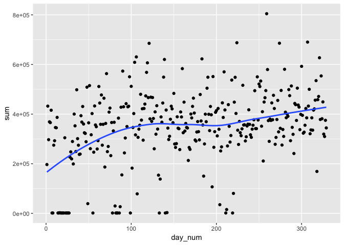
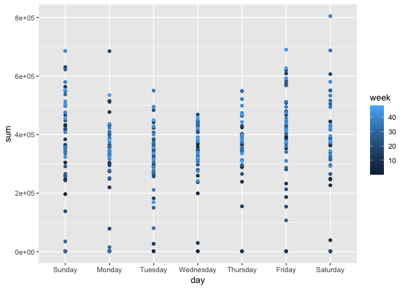
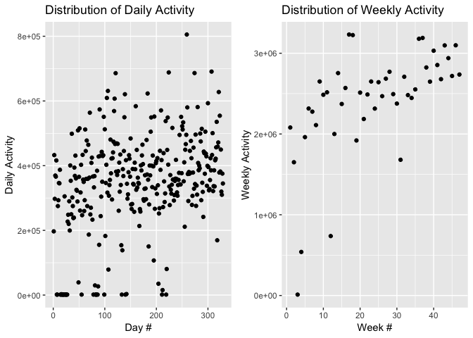
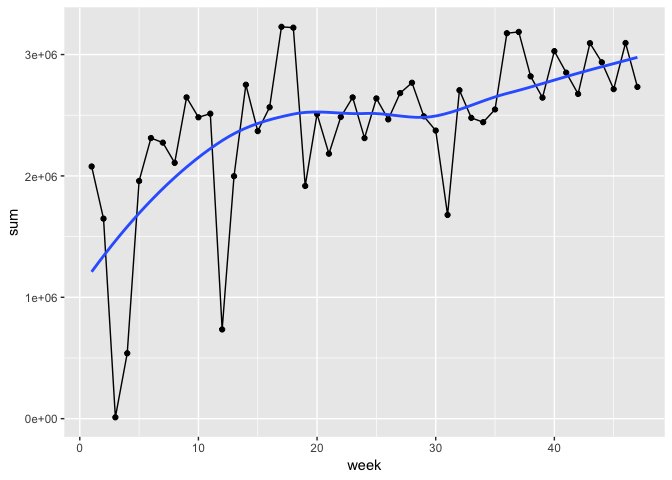
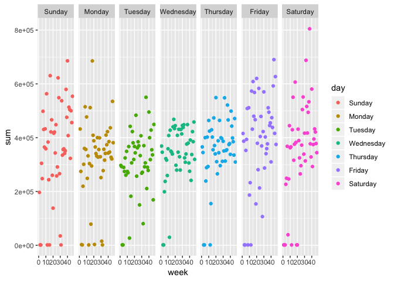
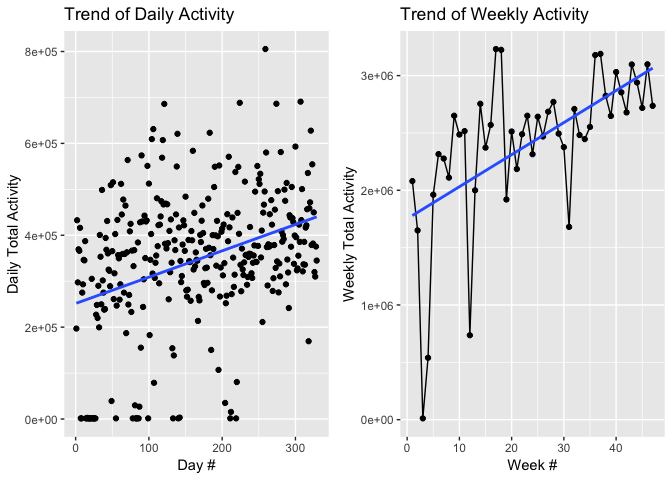

p8105\_mtp\_xy2395
================
Jack Yan
10/16/2018

First, load, tidy, and otherwise wrangle the data. Your final dataset should include all originally observed variables and values; have `useful variable names`; and code data with `reasonable variable classes`. `Describe the resulting dataset` (e.g. what variables exist, how many observations, etc). Discuss any additional exploratory analyses you conduct, but only include results you think are interesting (e.g. visually inspect distributions for outliers, but include only if these are informative).

``` r
motion_data = 
  read_csv("./data/p8105_mtp_data.csv") %>% 
  janitor::clean_names() %>% 
  gather(key = minute, value = value, activity_1:activity_1440) %>% 
  mutate(
    minute = str_replace(minute, "activity_", ""),
    minute = as.integer(minute),
    day = as.factor(day),
    day = forcats::fct_relevel(day, c("Sunday", "Monday","Tuesday","Wednesday","Thursday","Friday","Saturday")),
    value = as.integer(value)
  ) %>% 
  mutate(
    day_num = (week - 1) * 7 + as.numeric(day) %>% as.integer(),
    hour = as.integer(minute/60),
    minute_in_hour = as.integer(minute - 60 * hour)
  ) %>% 
  select(day_num, week, day, minute, hour, minute_in_hour, value) %>% 
  arrange(week, day, minute) 
```

    ## Parsed with column specification:
    ## cols(
    ##   .default = col_double(),
    ##   week = col_integer(),
    ##   day = col_character()
    ## )

    ## See spec(...) for full column specifications.

``` r
str(motion_data)
```

    ## Classes 'tbl_df', 'tbl' and 'data.frame':    473760 obs. of  7 variables:
    ##  $ day_num       : num  1 1 1 1 1 1 1 1 1 1 ...
    ##  $ week          : int  1 1 1 1 1 1 1 1 1 1 ...
    ##  $ day           : Factor w/ 7 levels "Sunday","Monday",..: 1 1 1 1 1 1 1 1 1 1 ...
    ##  $ minute        : int  1 2 3 4 5 6 7 8 9 10 ...
    ##  $ hour          : int  0 0 0 0 0 0 0 0 0 0 ...
    ##  $ minute_in_hour: int  1 2 3 4 5 6 7 8 9 10 ...
    ##  $ value         : int  1 1 1 1 1 1 1 1 1 1 ...

``` r
# interesting outliers and abnormal values
```

Traditional analyses of accelerometer data focus on the `total activity over the day`. Using your tidied dataset, aggregate across minutes to create a `total activity variable`. Using these data, explore the hypothesis that this participant became `more active` over time. You may want to make comparisons visually and / or quantitatively, or using formal statistical analyses.

``` r
sum_of_day = 
  motion_data %>% 
  group_by(day_num, week, day) %>% 
  summarize(
    sum = sum(value)
  )

sum_of_day %>% 
  filter(sum<100)
```

    ## # A tibble: 0 x 4
    ## # Groups:   day_num, week [0]
    ## # ... with 4 variables: day_num <dbl>, week <int>, day <fct>, sum <int>

``` r
motion_data %>% 
  filter(day_num==14)
```

    ## # A tibble: 1,440 x 7
    ##    day_num  week day      minute  hour minute_in_hour value
    ##      <dbl> <int> <fct>     <int> <int>          <int> <int>
    ##  1      14     2 Saturday      1     0              1     1
    ##  2      14     2 Saturday      2     0              2     1
    ##  3      14     2 Saturday      3     0              3     1
    ##  4      14     2 Saturday      4     0              4     1
    ##  5      14     2 Saturday      5     0              5     1
    ##  6      14     2 Saturday      6     0              6     1
    ##  7      14     2 Saturday      7     0              7     1
    ##  8      14     2 Saturday      8     0              8     1
    ##  9      14     2 Saturday      9     0              9     1
    ## 10      14     2 Saturday     10     0             10     1
    ## # ... with 1,430 more rows

``` r
# trend thru days
sum_of_day %>% 
  ggplot(aes(x = day_num, y = sum)) +
    geom_point() +
    geom_smooth(se = FALSE)
```

    ## `geom_smooth()` using method = 'loess' and formula 'y ~ x'



``` r
lm(day_num ~ sum, sum_of_day)
```

    ## 
    ## Call:
    ## lm(formula = day_num ~ sum, data = sum_of_day)
    ## 
    ## Coefficients:
    ## (Intercept)          sum  
    ##   8.748e+01    2.243e-04

``` r
sum_of_week = 
  motion_data %>% 
  group_by(week) %>% 
  summarize(
    sum = sum(value)
  )

sum_of_week
```

    ## # A tibble: 47 x 2
    ##     week     sum
    ##    <int>   <int>
    ##  1     1 2077807
    ##  2     2 1648150
    ##  3     3   11214
    ##  4     4  538812
    ##  5     5 1958367
    ##  6     6 2312073
    ##  7     7 2274164
    ##  8     8 2107621
    ##  9     9 2647174
    ## 10    10 2482858
    ## # ... with 37 more rows

``` r
# trend thru weeks
sum_of_week %>% 
  ggplot(aes(x = week, y = sum)) +
    geom_point() +
    geom_line() +
    geom_smooth(se = FALSE)
```

    ## `geom_smooth()` using method = 'loess' and formula 'y ~ x'



Additionally, examine the possibility that day of the week affects activity (in isolation and in addition to the effect of time).

``` r
motion_data %>% 
  group_by(day) %>% 
  summarize(sum = sum(value)) %>% 
  ggplot(aes(x = day, y = sum)) +
  geom_point()
```



``` r
motion_data %>% 
  group_by(week,day) %>%
  summarize(sum = sum(value)) %>% 
  ggplot(aes(x = day, y = sum, color = week)) +
    geom_boxplot()
```



``` r
motion_data %>% 
  group_by(week,day) %>%
  summarize(sum = sum(value)) %>% 
  ggplot(aes(x = week, y = sum, color = day)) +
    geom_point() +
    facet_grid(~ day)
```



One advantage of accelerometer data is the ability to inspect activity `over the course of the day`, rather than aggregating over 24 hours. Explore the distribution of activity counts in the full dataset, taking into account other variables of interest. Make a visualization that shows the 24-hour activity “profiles” for each day. Also visualize effects of time and day of the week on 24-hour activity profiles; incorporating smooth estimates of mean activity profiles may clarify these effects. Comment on relationships you think are interesting. (No formal statistical analyses are needed.)

``` r
motion_data %>% 
  group_by(day_num, hour,day) %>% 
  summarise(sum = sum(value)) %>% 
    ggplot(aes( x = sum, group = day,fill = day)) +
    geom_density(alpha = .3)
```



``` r
#install_github("unDocUMeantIt/sylly", ref="develop")
#install_github("unDocUMeantIt/koRpus")

#devtools::install_github("benmarwick/wordcountaddin", type = "source", dependencies = TRUE,force=TRUE)
#wordcountaddin::text_stats("p8105_mtp_xy2395.Rmd")
```
