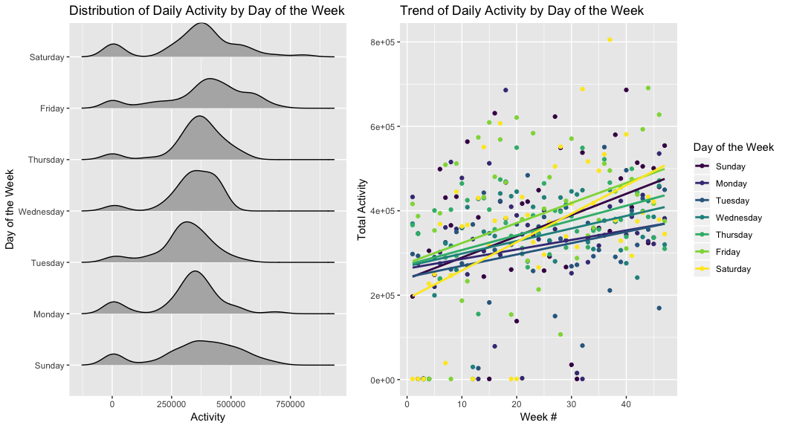
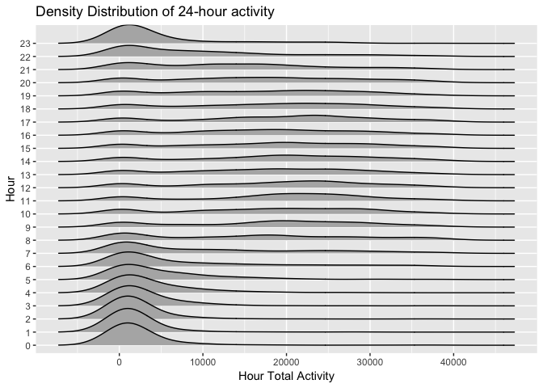
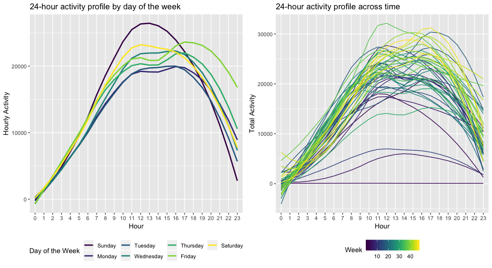
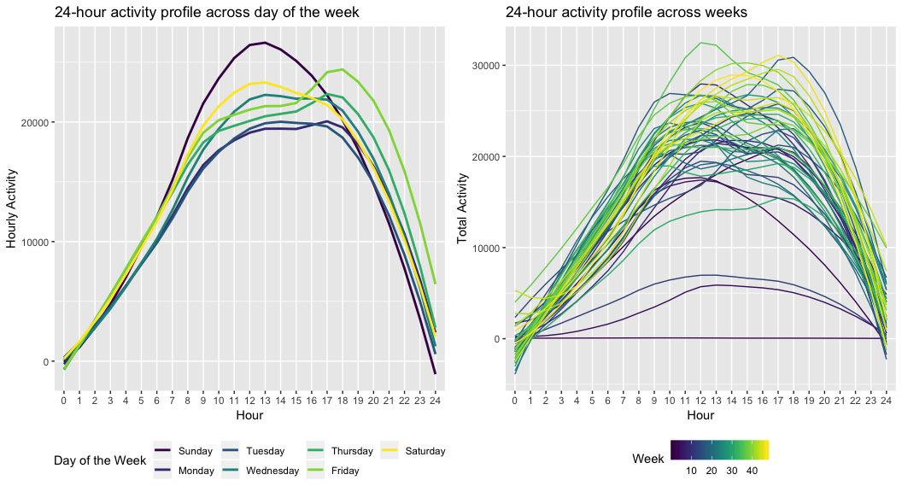

p8105\_mtp\_xy2395
================
Jack Yan
10/16/2018

``` r
library(tidyverse)
library(ggridges)
library(patchwork)
```

Data Import and EDA
===================

Data Import and Cleaning
------------------------

The original dataset consists of 329 rows and 1442 variables. The 1440 `activity_*` variables denote the measure of activity for 1440 minutes (60 minumtes / hour × 24 hours) in a day. Therefore, each row contains the activity data for a single day. Such data structure is not tidy, so I use `gather` function to aggregate all the values in the 1440 `activity_*` variables to a single variable, `activity`, and put variable names into a new variable, `minute`. Then I truncate the extra 'activity\_' string in the `minute` variable and change it to integer. The next thing is to change the `day` variable to factor and relevel them.

``` r
# Import and clean the dataset
motion_data = 
  read_csv("./data/p8105_mtp_data.csv") %>% 
  janitor::clean_names() %>% 
  gather(key = minute, value = activity, activity_1:activity_1440) %>% 
  mutate(
    minute = str_replace(minute, "activity_", "") %>% as.integer(),
    day = as.factor(day),
    day = forcats::fct_relevel(day, c("Sunday", "Monday","Tuesday","Wednesday","Thursday","Friday","Saturday"))
  )
```

    ## Parsed with column specification:
    ## cols(
    ##   .default = col_double(),
    ##   week = col_integer(),
    ##   day = col_character()
    ## )

    ## See spec(...) for full column specifications.

So far, the dataset has been cleaned and all the original values are preserved. (The original 1440 activity count variables are gathered into one variable.) But for further analysis, it may be helpful to create a `day_num` variable that denotes number of days past the beginning of the study, and a new variable `hour` that denotes the 24 hours in a day. As a final step, the variables and observations are arranged in a reasonable order.

``` r
motion_data = 
  motion_data %>% 
  mutate(
    day_num = ((week - 1) * 7 + as.numeric(day)) %>% as.integer(),
    hour = as.integer(minute / 60) %>% as.factor()
  ) %>% 
  select(day_num, week, day, minute, hour, activity) %>% 
  arrange(week, day, minute) 
```

Now, the final dataset has 473760 observations and 6 variables. As described above, the `activity` variable contains all the activity measurement in each minute. The variable `day` denotes the day in a week, and `week` denotes number of weeks. Variable `day` denotes the day in a week, and `minute` variable denotes the 1440 minutes in a day. `day_num` and `hour` are newly created variables that may facilitate grouping in the analysis. A summary of the variables in the cleaned dataset is shown below.

``` r
# Check the final dataset  
str(motion_data)
```

    ## Classes 'tbl_df', 'tbl' and 'data.frame':    473760 obs. of  6 variables:
    ##  $ day_num : int  1 1 1 1 1 1 1 1 1 1 ...
    ##  $ week    : int  1 1 1 1 1 1 1 1 1 1 ...
    ##  $ day     : Factor w/ 7 levels "Sunday","Monday",..: 1 1 1 1 1 1 1 1 1 1 ...
    ##  $ minute  : int  1 2 3 4 5 6 7 8 9 10 ...
    ##  $ hour    : Factor w/ 25 levels "0","1","2","3",..: 1 1 1 1 1 1 1 1 1 1 ...
    ##  $ activity: num  1 1 1 1 1 1 1 1 1 1 ...

Exploratory Data Analysis
-------------------------

To visualize the distribution of daily activity, I first group the activity by `day_num` and aggregate the counts in the `sum_daily_activity` variable. Then the daily total activity is plotted against day number. As shown in the graph, for some given days, activity measurement was close to zero. Those outliers are interesting, because it means the person wasn't moving at all in the whole day. It is also possible that the activity data was not recorded for these days, maybe because the person was not wearing the gear or because the gear was broken down these days.

The weekly total activity was plotted in the same way as the daily total activity. As shown in the plot on the right, total activity in some weeks at the beginning are extremely lower than other weeks, and for one week the activity is almost zero.

``` r
# Showing interesting outliers and abnormal values
# scatter plot for daily activity
plot_days = 
motion_data %>% 
  group_by(day_num) %>% 
  summarize(sum_daily_activity = sum(activity)) %>% 
  ggplot(aes(x = day_num, y = sum_daily_activity)) +
    geom_point() +
    labs(
      title = "Distribution of Daily Total Activity",
      x = "Day #",
      y = "Daily Activity"
    )
# scatter plot for weekly activity
plot_weeks =
motion_data %>% 
  group_by(week) %>% 
  summarize(sum_weekly_activity = sum(activity)) %>% 
  ggplot(aes(x = week, y = sum_weekly_activity)) +
    geom_point() +
    labs(
      title = "Distribution of Weekly Total Activity",
      x = "Week #",
      y = "Weekly Activity"
    )

# combine two plots above
plot_days + plot_weeks 
```



Daily Total Activity
====================

Daily and Weekly Trend
----------------------

The `total_activity` tibble contains the sum of activity for each day. To see if this participant became more active over time, plot the daily total activity among days, and also among weeks. The trend lines are plotted using `geom_smooth` with `loess` method. Weekly total activity is plotted with the same workflow. As shown in the first plot, daily total activity increased through the first and last 1/3 parts of the period, and witness a slight decline in the middle. As shown more clearly in the second plot, the weekly aggregate activity also increased over time, and followed the same pattern.

``` r
# calculate daily total activity 
total_activity = 
  motion_data %>% 
  group_by(day_num) %>% 
  summarize(sum = sum(activity))

# plot trend across days
trend_days = 
  total_activity %>% 
  ggplot(aes(x = day_num, y = sum)) +
    geom_point() +
    geom_smooth(method = 'auto', se = FALSE) +
    labs(
      title = "Trend of Daily Activity",
      x = "Day #",
      y = "Daily Total Activity"
    )

# calculate weekly total activity
sum_of_week = 
  motion_data %>% 
  group_by(week) %>% 
  summarize(
    sum = sum(activity)
  )

# plot trend across weeks
trend_weeks = 
  sum_of_week %>% 
  ggplot(aes(x = week, y = sum)) +
    geom_point() +
    geom_line() +
    geom_smooth(method = 'auto',se = FALSE) +
    labs(
      title = "Trend of Weekly Activity",
      x = "Week #",
      y = "Weekly Total Activity"
    )

# combine two plots
trend_days + trend_weeks
```

    ## `geom_smooth()` using method = 'loess' and formula 'y ~ x'
    ## `geom_smooth()` using method = 'loess' and formula 'y ~ x'



Daily Total Activity by Day of the Week
---------------------------------------

The first plot shows the density distribution of daily total activity by day of the week. We can see in this plot that the distribution of activity differs substantially among different days in a week. The majority of daily total activity for all days lies between 250,000 and 500,000, but for Sunday, Saturday and Friday, a larger portion of the area below the density curve shifts to a higher amount (between 500,000 to 750,000). That's to say, the person tend to have more activity on Sunday, Saturday and Friday. Also, the peak for Sunday is lower than other days, which indicates a higher diversity.

``` r
# density distribution of daily total activity by day of the week
total_activity_dow = 
  motion_data %>% 
  group_by(week, day, day_num) %>%
  summarize(sum = sum(activity)) %>% 
  ggplot(aes(x = sum, y = day)) + 
  geom_density_ridges(scale = .85) +
  labs(
    y = "Day of the Week",
    x = "Activity",
    title = "Distribution of Activity by Day of the Week"
  ) +
   viridis::scale_color_viridis(
    name = "Day of the Week", 
    discrete = TRUE
  )

# Plot trend of daily total activity grouped by day of the week
# See if the progress of time affects daily activity 
trend_days_by_dow = 
  motion_data %>% 
  group_by(week, day, day_num) %>%
  summarize(sum = sum(activity)) %>% 
  ggplot(aes(x = week, y = sum, color = day)) +
    geom_point() +
    geom_smooth(method = 'lm', se = FALSE) +
    labs(
      title = "Trend of Activity by Day of Week",
      x = "Week #",
      y = "Total Activity"
    ) +
   viridis::scale_color_viridis(
    name = "Day of the Week", 
    discrete = TRUE
  )

# combine and show the two plots
total_activity_dow + trend_days_by_dow
```

    ## Picking joint bandwidth of 42800



The second plot above shows the scatterplot of the distribution of daily total activity across weeks. More importantly, it shows the trend of daily activity using `geom_smooth` with the `lm` method. The second plot suggests that the trends of activity by different days of week are different. Interestingly, the daily activity increased for all days in the week over time, but the slope differs. For example, the daily activity increased the most in Sundays and the least in Mondays.

Activity over the course of a day
=================================

24-hour activity profiles
-------------------------

Also visualize effects of `time` and `day of the week` on 24-hour activity profiles; incorporating smooth estimates of mean activity profiles may clarify these effects.

Comment on relationships you think are interesting. (No formal statistical analyses are needed.)))

In this section, we start to investigate how activity counts vary in 24 hours each day. In the data cleaning step, a new variable `hour` has been created to denote 24 hours in a day. So we can group the dataset by `hour` and `day` and draw a ridgeline plot to see the distribution of hourly activity in different days. Since there are some outliers in the `hour_activity` variable that overly extend the X scale and therefore affect readability, values &gt; 40000 in `hour_activity` was filtered out.

``` r
# create a density ridges plot to see the distribution of hourly activity
  motion_data %>% 
  group_by(day_num, hour) %>% 
  summarize(hour_activity = sum(activity)) %>% 
  filter(hour_activity <= 40000) %>% 
  ggplot(aes(y = hour, x = hour_activity)) +
    geom_density_ridges() +
    labs(
      x = "Hour Total Activity",
      y = "Hour",
      title = "Density Distribution of hourly activity"
    )
```

    ## Picking joint bandwidth of 2350



We can see from this plot what time everyday this person tended to be more active (or maybe awake). We can also indicate the person's daily routine. For example, from 10 pm to 7 am, the person tended to be inactive (or maybe sleeping). We cannot see a significant defference in distribution of activity among hours when the person is awake. The pattern looks similar from 9 am to 9 pm.

Effects of time and day of the week on 24-hour activity profiles
----------------------------------------------------------------

Group the dataset by day of the week and hour, so that we can see how the *average hourly activity* change in 24 hours. I calculate the *average hourly activity* by summing up the activity counts in each group and divide it by the total number of weeks, 47. The 24-hour trend line for activity was plotted using the default "loess" method.

As shown in the first plot, the person tends to be the most active around 12 pm on Sundays, and is also very active around 6 pm on Fridays and around 12 pm on Saturdays. Maybe the person was more willing to do exercise during weekends. We can also see that on Thurdays, Mondays and Fridays, the peak of activity is round 6 pm, which is different from other days, and maybe this is related to his work shift.

``` r
# visualize effects of time and day of the week on 24-hour activity profiles
# effect of day in the week on 24-hour activity profiles
activity_profile_dow = 
  motion_data %>% 
  group_by(day, hour) %>%
  summarize(avg_activity = sum(activity) / 47) %>% 
  ggplot(aes(x = hour, y = avg_activity, group = day, color = day)) +
    geom_smooth(se = FALSE) +
    labs(
      x = "Hour",
      y = "Hourly Activity",
      title = "24-hour activity profile across day of the week"
    ) +
    viridis::scale_color_viridis(
    name = "Day of the Week", 
    discrete = TRUE
  ) +
  theme(legend.position = "bottom")

# effect of week number on 24-hour activity profiles
activity_profile_week = 
  motion_data %>% 
  group_by(week, day_num, hour) %>%
  summarize(sum_activity = sum(activity)) %>% 
  ggplot(aes(x = hour, y = sum_activity, group = week, color = week)) +
    geom_smooth(se = FALSE, size = 0.5) +
    labs(
      x = "Hour",
      y = "Total Activity",
      title = "24-hour activity profile across weeks"
    ) +
    viridis::scale_color_viridis(
    name = "Week", 
    discrete = FALSE
    ) +
    theme(legend.position = "bottom")

activity_profile_dow + activity_profile_week
```

    ## `geom_smooth()` using method = 'loess' and formula 'y ~ x'
    ## `geom_smooth()` using method = 'loess' and formula 'y ~ x'


To examine the effect of time on 24-hour activity profiles, I choose to use average activity data across weeks. That is to say, the trend lines are grouped by weeks, so there are 47 trend lines, each showing the average 24-hour profile in a single week.

We can see that with the progress of time, activity tends to have a higher peak, indicating more activity.
